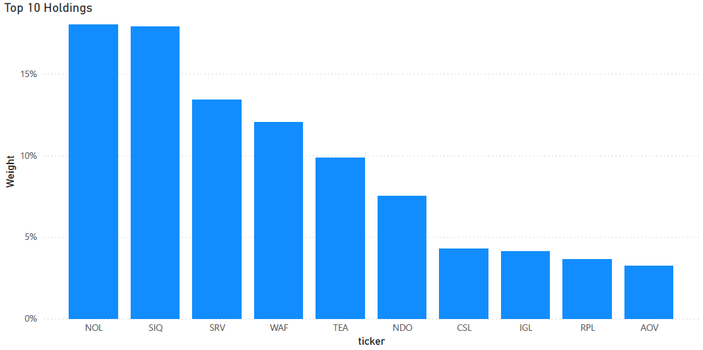
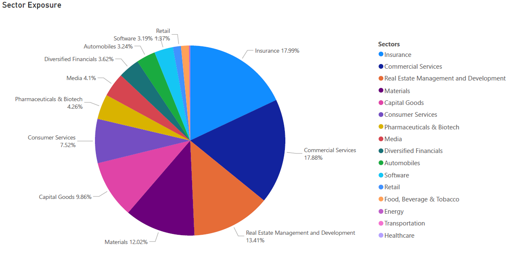
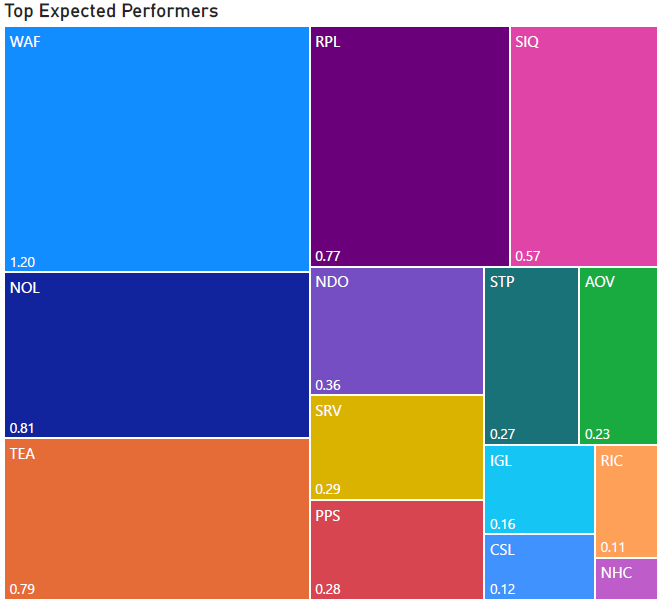

## 📈 End-to-End Financial Pipeline

This project is an **End-to-end financial data pipeline** including **ETL**, **Data enhancement**, **Portfolio optimization** and **BI visualization**.

## 🛠️ Tech Stack

- **Languages**: Python, SQL  
- **Libraries**: Pandas, cvxpy , numpy, Regex, Requests, SQLAlchemy/psycopg2  
- **Database**: PostgreSQL  
- **API**: SWS API
- **Visualization**: Power BI
---

### 📁 Phase 1 — ETL

 🔹 **Extract** from API via GraphQL query  
 🔹 **Transform** via Python/Pandas  
 🔹 **Load** into PostgreSQL database  

| Step | Script Name                         | Description |
|------|-------------------------------------|--------------------------------------------------------------------------------------------------|
| 1    | `1.Get_Exchanges.py`                | - Retrieves available exchanges & their company count.
| 2    | `2.Get_Companies.py`                | - Retreives all tickers & their core data for each exchange.
| 3    | `3.Get_All_Data.py`                 | - Iterates through all tickers and retreives all data types (listings,statements,owners,members,insider transactions).
| 4    | `4.1Get_All_Data_Failures.py`       | - Iterates through all failed tickers . Redo until all data has been retreived.
| 5    | `5.Transpose_Statements.py`         | - Perform transformations to align data with DB schemas.
| 6    | `6.Load_temp_DB.py`                 | - Load data in temp DB.
| 7    | `7.Insider_transactions_identify.py`| - Check & remove duplicate records.
| 8    | `8.Move_To_Prod.py`                 | - Move to data to Prod DB.

---

### 🧠 Phase 2 — Enhancement layer

🔹 Extract data from text using **Regex**  
🔹 Create **Attribution / Rankings Table** (Value, Growth, Past Performance, Dividend, Health)
       

| Step | Script Name                         | Description |
|------|-------------------------------------|--------------------------------------------------------------------------------------------------|
| 1    | `1.Snowflake.py`                    | - Create attribution table
| 2    | `2.NLP_Extract_Data.py`             | - Extract data from text
| 3    | `3.Final_Reformat.py`               | - Cleanse & prepare data for DB
| 4    | `4.Load_DB.py`                      | - Load to DB

---

### 📊 Phase 3 — Analytics & Portfolio Construction

 🔹 List **winners** based on attribution rankings  
 🔹 Calculate **stock weights** for **maximum Sharpe Ratio** under constraints

| Step | Script Name                       | Description                                                                                         |
|------|-----------------------------------|-----------------------------------------------------------------------------------------------------|
| 1    | `1.1.Extract_Top_50_Snowflake.py` | Extract Top 50 companies based on the 5 key attributes for a specific exchange.                     |
| 2    | `2.Get_Expected_Returns.py`       | Calculate expected price return, total return, annualized volatility and Sharpe Ratio.             |
| 3    | `3.Portf_opt.py`                  | Optimize portfolio weights to **maximize Sharpe Ratio** with constraints (see below).               |

**Portfolio Constraints:**
- Long-only positions  
- At least **1 company per primary industry**  
- Maximum **10% allocation per position**               
                                                                                                                                                                                                                          
---

### 📈 Phase 4 — BI Visualization & Dashboards

🔹 **Top 10 Holdings**  
🔹 **Sector Exposure**  
🔹 **Top Expected Performers**  

---

### 🧭 End-to-End Workflow

---

### 🆔 Project Info

**Author:** *Nicholas Papadimitris*  
**Created on:** *17/05/2025 6:47 PM* (UTC)  
**Last modified:** *17/05/2025 6:47 PM* (UTC)   
**Project ID:** `Finance_Project_NP_17_May2025`  
**GitHub:** [My GitHub](https://github.com/NPStraight2ThePoint)

📧 **Email:** nicholas.papadimitris@gmail.com  
💼 **LinkedIn:** [Nicholas Papadimitris](https://www.linkedin.com/in/nicholas-papadimitris/)

## License

This project is licensed under the MIT License - see the [LICENSE](./LICENSE) file for details.
